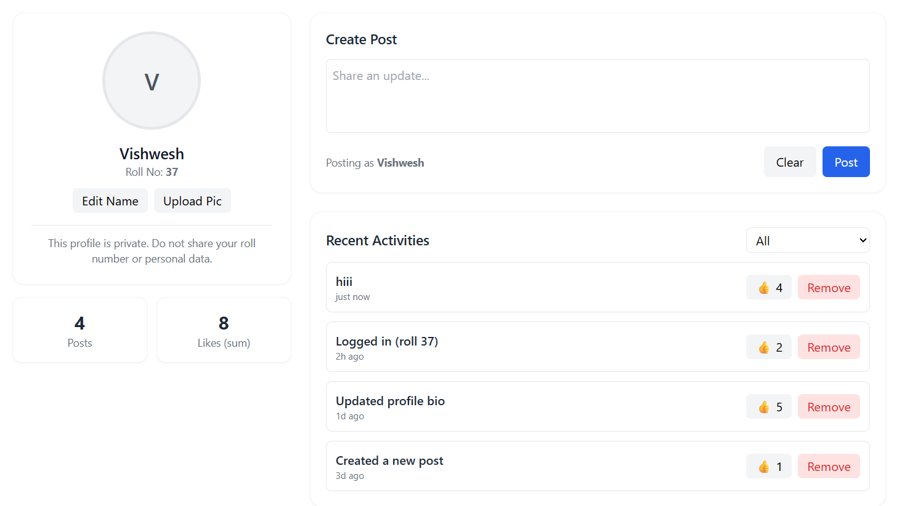

📝 README.md
# React Profile Dashboard

A clean and modern **Profile Dashboard** built with **React** and **Tailwind CSS**.  
This project demonstrates React fundamentals including **state**, **props**, **events**, and **class components**, wrapped in a responsive dashboard layout.

---

## 🚀 Features

- **Profile Card**
  - Edit user name  
  - Upload a profile picture  
  - View private info reminder

- **Activity Feed**
  - Displays recent activities  
  - Like or remove items interactively  
  - Filter between *All* and *Popular (≥3 likes)*  

- **Post Creator**
  - Create and post new activity updates  
  - Real-time addition to the activity list  

- **Stats Overview**
  - Shows total number of posts  
  - Displays total number of likes  

- **Profile Preview**
  - Quick view of user’s current profile (name, avatar, roll number)

---

## 🧠 Tech Stack

- **React (Functional + Class Components)**
- **Tailwind CSS**
- **JavaScript (ES6+)**
- **HTML5 + JSX**

---

## ⚙️ Installation & Setup

### 1️⃣ Clone this repository
```bash
git clone https://github.com/your-username/my-dashboard.git
cd my-dashboard

2️⃣ Install dependencies
npm install

3️⃣ Start the development server
npm start

4️⃣ Open in your browser

Navigate to http://localhost:3000

📁 Folder Structure
my-dashboard/
│
├── public/
│   ├── index.html
│   ├── favicon.ico
│   └── ...
│
├── src/
│   ├── App.jsx          # Main App file
│   ├── index.js         # Entry point
│   ├── index.css        # Tailwind/global styles
│   ├── logo.svg
│   ├── reportWebVitals.js
│   ├── setupTests.js
│   └── ...
│
├── package.json
└── README.md

🧩 Customization Notes

Replace ROLL_NUMBER in App.jsx with your assigned roll number before submission.

Avoid sharing personal data — this dashboard is for learning & demonstration purposes only.

You can adjust styling in index.css or via Tailwind classes.

🧼 UI Theme

This project uses a white background + black text for clarity and accessibility.
Components include consistent spacing, rounded corners, and subtle hover transitions for a modern dashboard look.

🖼️ Project Snapshot

Below is a preview of the final UI layout:


🪪 License

This project is open for educational use only.
Feel free to modify and use for personal learning.

Made with ❤️ using React + Tailwind CSS